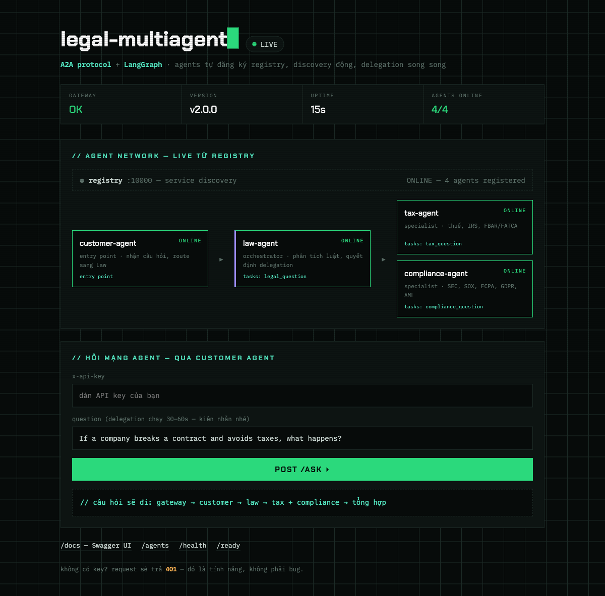

# Bài Nộp: Legal Multi-Agent System — Production Deployment

> **Sản phẩm Day 9** (Multi-Agent với A2A protocol) **+ hạ tầng Day 12** (cloud deployment).
> Live demo: **https://my-production-agent-production.up.railway.app**



## Tóm tắt cho giảng viên

Folder này là bài làm kết hợp 2 buổi học:

- **Ruột — Day 9:** Legal Multi-Agent System gồm Registry (service discovery) và 4 agents
  giao tiếp qua **Google A2A protocol**, build bằng **LangGraph**: Customer Agent nhận câu
  hỏi → Law Agent phân tích và quyết định routing → delegate **song song** sang Tax Agent +
  Compliance Agent → tổng hợp trả lời. Code lấy từ repo Day 9, **không gồm `Lab Assignment/`**.
- **Vỏ — Day 12:** gateway production-ready bọc quanh mạng agent: API key auth (401),
  rate limiting 10 req/phút (429), cost guard $10/tháng (402), `/health` + `/ready`,
  graceful shutdown (SIGTERM), state trong Redis, JSON logging, Docker multi-stage,
  deploy Railway, CI/CD GitHub Actions.

## Kiến trúc

```
                       Client / Browser
                              │
                              ▼  $PORT
            ┌──────────────────────────────────┐
            │  Gateway (app/) — FastAPI         │
            │  auth · rate limit · cost guard   │
            │  /health /ready /agents /ask      │
            └───────────────┬──────────────────┘
                            │ A2A (JSON-RPC)
   cùng 1 container         ▼
   (run_all.py)   ┌─ Customer Agent :10100 ─┐
                  │         │                │      ┌─ Redis ─┐
                  │         ▼                │      │ history │
                  │   Law Agent :10101       │      │ ratelimit│
                  │     │           │        │      │ budget  │
                  │     ▼           ▼        │      └─────────┘
                  │ Tax :10102  Compliance   │
                  │             :10103       │
                  │  (delegation song song)  │
                  │         ▲                │
                  │  Registry :10000         │
                  │  (agents tự đăng ký,     │
                  │   discovery động)        │
                  └──────────────────────────┘
```

## Cách chấm / chạy thử

### 1. Live trên cloud (nhanh nhất)

Mở **https://my-production-agent-production.up.railway.app** — trang *mission control*:
- Sơ đồ mạng agent **live từ Registry** (4/4 ONLINE, tasks từng agent)
- Gõ câu hỏi pháp lý → `POST /ask ▸` → chờ 30–60s (delegation thật qua OpenRouter LLM)
- Lớp bảo mật demo bằng curl:

```bash
# Không key → 401
curl -X POST https://my-production-agent-production.up.railway.app/ask \
  -H "Content-Type: application/json" -d '{"question":"x"}'

# Mạng agent đang online
curl https://my-production-agent-production.up.railway.app/agents
```

### 2. Chạy local

```bash
cp .env.example .env     # điền AGENT_API_KEY, DEMO_API_KEY, OPENROUTER_API_KEY
docker compose up -d --build
open http://localhost:8088
```

### 3. Validation + tests

```bash
python check_production_ready.py   # 20/20 checks (script chấm của Day 12)
pip install -r requirements.txt -r requirements-dev.txt
ruff check app tests               # lint
pytest                             # 34 tests, coverage ~94% (gate 80%)
```

### 4. CI/CD (bonus)

Mỗi push vào `main`: **lint (ruff) → unit tests + coverage ≥80% → deploy Railway →
smoke test** — xem [`.github/workflows/ci-cd.yml`](../.github/workflows/ci-cd.yml)
và tab [Actions](https://github.com/theluu/batch02-day12_cloud_infras_and_deployment/actions).

## Cấu trúc folder

| Path | Vai trò | Nguồn |
|---|---|---|
| `app/` | Gateway production: main, auth, rate_limiter, cost_guard, config, llm (A2A client), home (UI) | Day 12 |
| `registry/` | Service discovery — agents tự đăng ký, discover theo task | Day 9 |
| `common/` | LLM factory (OpenRouter), A2A client, registry client | Day 9 |
| `customer_agent/` | Entry point — route câu hỏi sang Law | Day 9 |
| `law_agent/` | Orchestrator — StateGraph, delegation song song (`Send` API) | Day 9 |
| `tax_agent/`, `compliance_agent/` | Specialists (ReAct agents) | Day 9 |
| `run_all.py` | Supervisor: khởi động 5 services + gateway trong 1 container | mới |
| `tests/` | 34 unit/integration tests (fakeredis + mocked A2A) | mới |
| `Dockerfile` | Multi-stage, non-root, HEALTHCHECK | Day 12 |
| `PRODUCT_README.md` | README gốc của sản phẩm Day 9 (chi tiết LangGraph patterns) | Day 9 |

## Secrets

Không có secret nào trong code/git: `AGENT_API_KEY`, `OPENROUTER_API_KEY`… nằm trong
`.env` (gitignored) ở local và **Railway Variables** trên cloud. `DEMO_API_KEY` được
server nhúng vào trang chủ để giảng viên demo không cần dán key — request từ console
vẫn đi qua đủ auth + rate limit + cost guard.
